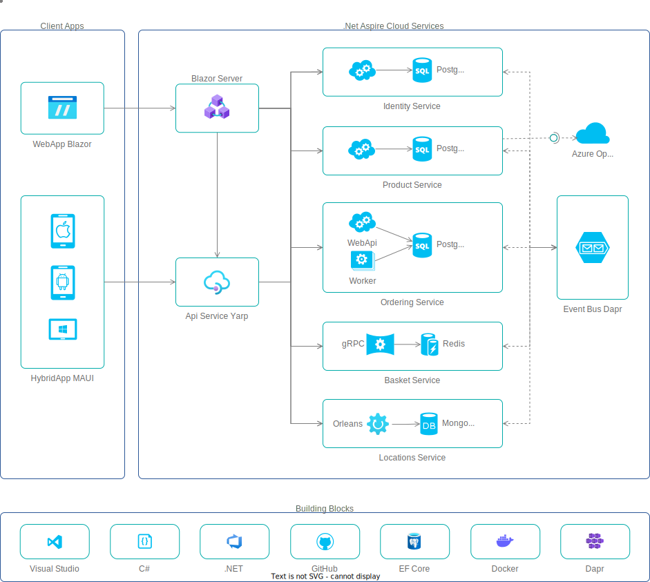

朋友们，零度新一代基架今日正式开始搭建。我们非常激动地宣布，新一代基架起名为 HelloShop 项目， 这个基架将演示新一代 .NET 技术栈开发架构，之所以起名为 HelloShop 是以为简单的商店应用能够演示出一个系统的所有技术，当然，这个商城系统也可以是其它系统，只要你能够理解这个基架的设计思想，你就能够快速搭建一个系统，以下文档由 AI 生成，可能会有一些语法错误，我们会在后期进行修正。

### 业务场景

本商店应用旨在演示一个系统的所有技术，帮助开发者以最小的依赖和代码搭建一个系统，将不同的技术置于微服务架构中。开发者可以根据自己的业务需求快速复用代码并搭建一个系统，而不是花费大量时间在一个通用的框架上。

我们的目标是提供细粒度的微服务架构和最佳实践，让您可以自行组合各种技术。统一的身份认证和授权系统，服务发现，负载均衡，容错，分布式跟踪，分布式缓存，分布式事务，分布式消息，分布式日志，分布式配置，分布式定时任务等等。

此外，我们还提供了界面，包括基于 Blazor 的 Web 应用和基于 MAUI 的混合应用，可以在不同的平台上运行，包括桌面应用，安卓应用和 IOS 应用。

### 所含技术

Visual Studio 2022 .NET 8、C# 12.0、Aspire、ASP.NET Core，EF Core、WebApi、gPRC、Blazor、MAUI、PostgreSQL、MonngDB、Redis、SignalR、Identity、Orleans、日志记录、密钥管理、后台定时任务、服务发现、发布订阅、分布式跟踪、健康检查、性能指标探测、配置管理、容器化技术、单元测试和集成测试、基于 Roslyn 的源代码自动生成器和增量生成器。

### 仓库结构

在仓库的结构上，我们跟随了微软惯用的风格，目录结构如下：

`assets` 静态资源，包括图片，图标，视频，音频等。

`build` 构建脚本，包括编译脚本，打包脚本，发布脚本等。

`docs` 相关文档，包括设计文档，架构文档，开发文档，部署文档等。`

`samples` 演示示例，包括代码示例，配置示例，数据示例，文档示例等。

`src` 源代码，包括源代码，配置文件，资源文件，脚本文件等。

`tests` 测试代码，包括单元测试，集成测试，端到端测试等。

`tools` 项目所使用的一些工具。

### 代码仓库

国外仓库：https://github.com/bit365/hello-shop

国内仓库：https://gitee.com/bit365/hello-shop

### 后续计划

我们刚刚还注册了 helloshopnet.com 和 helloshopnet.cn 两个域名用于后期的基架部署，也算是给 HelloShop 安一个家，目前还是正在备案。

### 技术探讨

本套基架会有一些配套视频在 www.xcode.me 上发布。如果你想要获取最新的视频可以关注我们的微信订阅号 zerostack，我们会在公众号上发布最新的动态，如果你觉得这套基架对你有帮助，你可以给我们一个 Star，这是对我们最大的鼓励。

最后我们希望这套基架能帮助到你，如果你有任何问题可以在 Github 上提出我们会尽快回复，坚持优雅的编码是我们一直所追求的，希望你也能够参与这种优雅。
